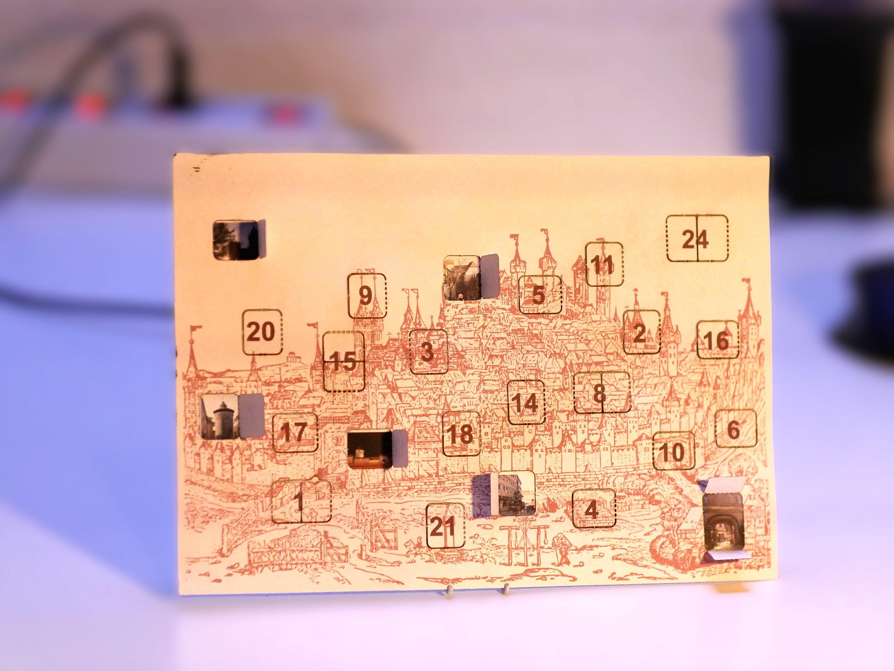
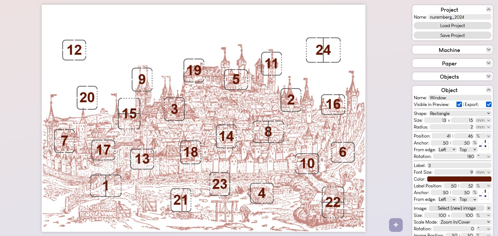
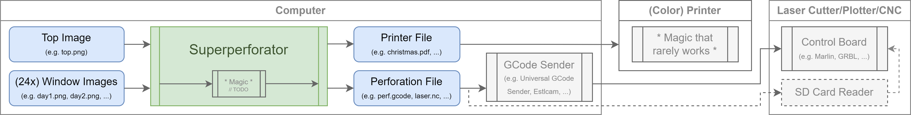
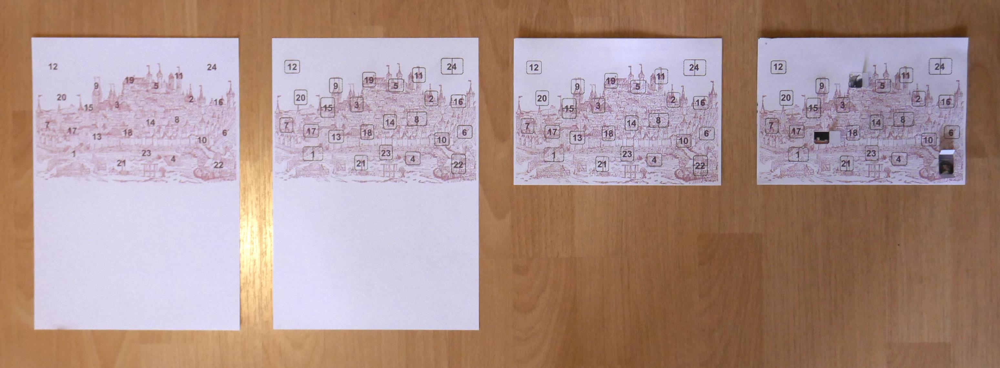
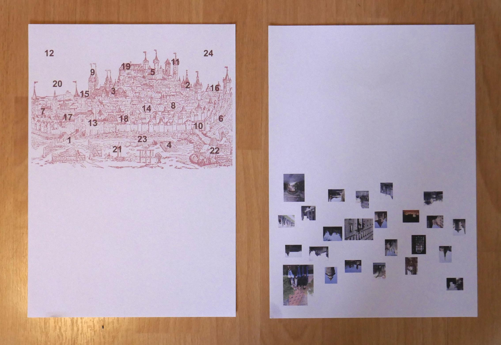

# Superperforator - Create personalized christmas cards with ease

## Overview

Superperforator is an easy-to-use tool that enables makers to create their own advent-calendar-cards with unique and personal images behind each door.

## How to use

### Getting started

Here is a quick start into how you can make your own custom christmas cards using this tool.

#### Preparations

You will need:
 - a computer with a modern web browser and a copy of the superperforator program
 - thick paper twice the size of your final card (i used paper with a thickness of 250g/m² but i would recommend using even stronger paper)
 - a (color) printer capable of printing your preferred paper
 - either a laser cutter, plotter (e.g. CriCut), a mill with a paper cutter or a hobby knife and a lot of time
 - one large background image and 24 smaller images, one for each day before christmas

#### Using Superperforator

See further down on how to start the superperforator application. As a quick start, you can use the hosted version [here](https://martinkunze.com/tools/superperforator).

Expand the paper settings on the right side, enter your preferred page size (by default DIN A5 or 210×148mm), such that everything can be printed on one DIN A4 page and folded in the middle) and upload your background image. You can change how your image is fitted and positioned using the size, scale mode and position settings that should be visible now. Close the paper settings again.

Add a window using the + button in the lower right corner. A new item should have appeared in your preview and the objects settings should have expanded. Click on the item in the objects list, the object settings should expand. Set the preferred shape and dimensions, you can then set the position. Unless you want to have precise control over the exact location of the window you only have to change the position setting. You might want to change the label (what is displayed on the window item) and the respective font. You can now add a image that will be visible after someone opened the window on their christmas calendar. As with the background, you can change the size, scale mode and position of the image relative to the enclosing shape.

If you want to change the same setting for multiple items at once, select them from the objects list while holding Ctrl.

After adding the remaining 23 windows, you can preview your final calendar by expanding the display settings and hiding the cutouts. Finally you can export your calendar using the export settings. By default this will return a PDF file (.pdf) and a GCode file (.gcode or .nc).

Now you are ready to print, cut and assemble your calendar. The first step is obvious: print the PDF file onto your thick paper. The generated print file is designed to be double sided, so if your printer does not support duplex, you have to turn the page manually to get a double sided print.

Step 2: After that, load your printed paper onto your cutter of choice, in my case a laser cutter based on a cheap 3018 mill. Load the GCode file into your cutter software, in my case [UGS (Universal GCode Sender)](https://github.com/winder/Universal-G-Code-Sender), and hit send. Please take care of your personal safety; close all designated enclosures, wear safety goggles, don't inhale the fumes, etc. If you do not have a machine to cut your card automatically, you can cut it by hand, although you need to bring a lot of time and patience to do so. Clean the card from any debris and residue left over from the cutting process. 

Step 3: Next, fold your card in half while aligning both sides as good as possible. You may be able to peek through the newly cutted slots to fine adjust where the edges of the underlying images are. Now you are ready to glue both halves together. Unfold the card and apply some (paper-/wood-/craft-) glue to the cut side. Only apply it to the areas that are not windows, otherwise they cannot be opened afterwards and the card will not work; always leave a gap to the edges of the window and remove excess glue before closing the card back up. Now, and this is very important, put something flat and very heavy on top of the card so the paper does not curl or buckle. Leave it on the card for ~24 hours. Trust me, I have tried to shortcut this step by only letting it dry for 10 hours and I always regretted it.

Step 4: Enjoy your finished calendar. You can gift it to friends and family so they can enjoy your personal experience during christmas :)

#### Calibrating and testing different values

[TODO]

### Options

[TODO]

#### Machine

[TODO]

#### Paper

[TODO]

#### Object

[TODO]

#### Display

[TODO]

#### Export

[TODO]

## How to run

### The easy way

A hosted version of this program can be found [here](https://martinkunze.com/tools/superperforator). Please make sure your browser is supported and up-to-date.

### The secure way

You can download the latest version (`superperforator-vX.X.X.html`) from the [latest releases](https://github.com/maddinkunze/superperforator/releases/latest) page and run it locally by simply double clicking on it. The program should open as a web page in your default browser. Please make sure your browser is supported and up-to-date. Older versions can be found in the [releases overview](https://github.com/maddinkunze/superperforator/releases).
This way, you can use the tool even without internet access.

### The developer way

You can `git clone https://github.com/maddinkunze/superperforator` the repository and run the `index.html` file within the `src` directory.

#### "Building"

You can combine ("build") a single file by running the `combine.py` file within the `build` directory. You will need a recent python3 install to do so. A new file called `superperforator-vX.X.X.html` (the same as would be in the releases page) should appear in the `build` directory.

## Attributions

Big thanks to
 - [Eli Grey](https://github.com/eligrey) for [FileSaver.js](https://github.com/eligrey/FileSaver.js) (MIT License)
 - [James Hall](https://github.com/MrRio) and his company [parallax](https://github.com/parallax) for [jsPDF](https://github.com/parallax/jsPDF) (MIT License)
 - [Chen Yining](https://www.dafont.com/chen-yining.d6681) for the [Louis George Café](https://www.dafont.com/louis-george-cafe.font) font (Permissive License)

Also, if you've got all the way to down here, I highly recommend you to listen to the song [superperforator](https://youtu.be/KtxOWwgkmzw) from the movie [Schuh des Manitu](https://www.imdb.com/title/tt0248408/). It has a special place in my heart.